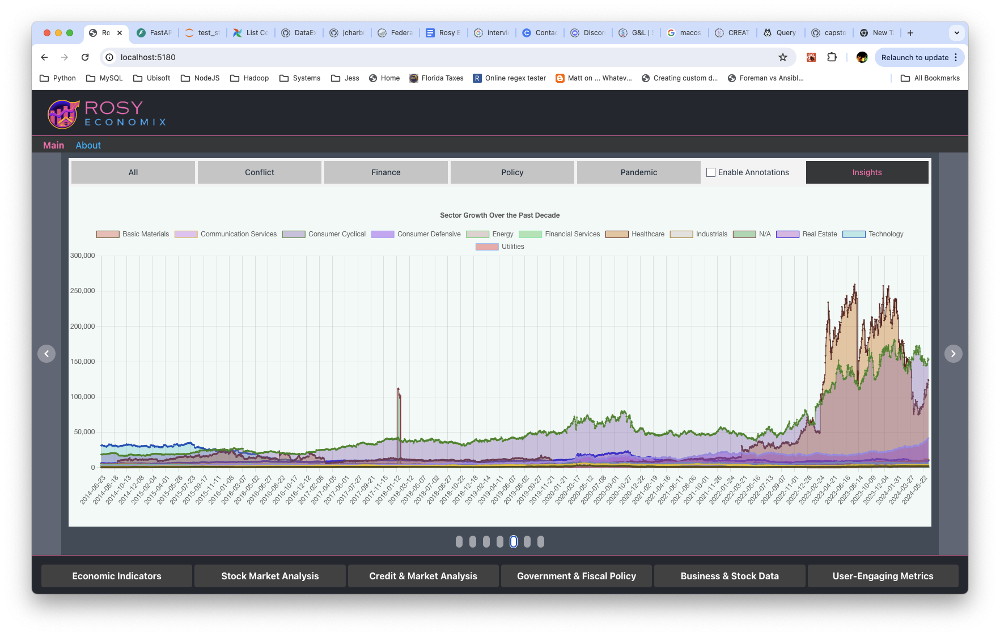
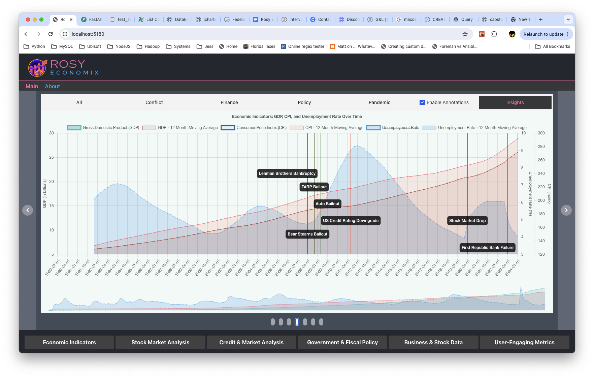

# Unveiling Economic Insights with Advanced Data Processing: The Rosy Economix Capstone Project

In today’s data-driven world, understanding the intricate relationships between economic indicators and financial markets is paramount. This article delves into the Rosy Economix Capstone Project, a sophisticated initiative aimed at leveraging modern data processing technologies to analyze and decode economic trends. Let’s explore the objectives, tools, datasets, and the roadmap of this ambitious project.

## Project Overview

The Rosy Economix Capstone Project aims to develop a comprehensive system capable of real-time data processing and advanced analytics. By integrating various economic datasets with cutting-edge technologies, we seek to provide valuable insights for stakeholders in the financial domain.

## Objectives

The primary objective is to create a platform that can:
- Analyze economic indicators and their impact on financial markets.
- Classify companies by verticals or industries and identify trends.
- Correlate data to understand the effect of economic interventions and large impacts.

## Tools and Technologies

To achieve our objectives, we are utilizing a suite of powerful tools and technologies:
- **Airflow** for workflow management.
- **Trino (formerly PrestoSQL)** for distributed SQL query execution.
- **Apache Iceberg** for handling large analytic tables.
- **PostgreSQL** as our database system.
- **Docker** to streamline environment setup.
- **ReactJS** and **FastAPI** for the application side.

## Key Datasets

### FRED (Federal Reserve Economic Data)
FRED offers a wealth of economic data, including credit delinquency rates, credit volumes, and various financial indicators. Our project focuses on critical datasets like GDP, CPI, and unemployment rates to build robust economic models.

### Stock Data
To meet the objective of analyzing over a million rows of data, we leverage Yahoo Finance’s extensive historical stock data. This dataset covers the last 35 years and includes companies from diverse industries such as Technology, Energy, and Retail. The dataset, available for download [here](https://www.jessecharbneau.com/downloads/stock_data_last_35_years.csv.gz), contains 1.3 million rows and details like stock ticker, company name, and industry classification.

Here’s a glimpse of the dataset:

| Stock Ticker | Company Name | Industry |
|--------------|--------------|----------|
| AAPL         | Apple Inc.   | Consumer Electronics |
| MSFT         | Microsoft Corporation | Software - Infrastructure |
| IBM          | International Business Machines Corporation | Information Technology Services |
| GE           | General Electric Company | Aerospace & Defense |
| KO           | The Coca-Cola Company | Beverages - Non-Alcoholic |
| JNJ          | Johnson & Johnson | Drug Manufacturers - General |
| XOM          | Exxon Mobil Corporation | Oil & Gas Integrated |
| PG           | The Procter & Gamble Company | Household & Personal Products |
| MCD          | McDonald’s Corporation | Restaurants |
| WMT          | Walmart Inc. | Discount Stores |

## Project Implementation and Notes

- **Docker Setup**: We utilized Docker to manage the environment for ReactJS, FastAPI, and PostgreSQL.
- **Airflow**: Airflow is set up and ready, but using the Yahoo Finance API for more than 500 stock tickers proved slow. While a DAG is stubbed out, it’s basic and does not perform data updates at this time.
- **Astro Compose Environment**: Overrode the Astro Compose environment to facilitate hosting the React and FastAPI environments.
- **Data Analysis and Visualizations**: Spent considerable time on data analysis, particularly visualizations, to answer key questions using the available data.
- **OpenAI Integration**: Following advice from a friend and inspired by autograding approaches, we explored integrating OpenAI. Initial tests with annotations and leveraging OpenAI to analyze charts have been insightful, showing a lot of potential.

## Key Questions and Visualizations

Here are the key questions we aimed to answer, along with some visualizations that provide insights:

### Economic Indicators
1. **How do GDP growth rates correlate with stock market performance?**

   

2. **What is the relationship between unemployment rates and consumer spending?**

   

3. **How do inflation rates impact the stock prices of different sectors?**

   

### Stock Market Analysis
1. **Which sectors have shown the highest growth over the past decade?**

   

### Insights and Visualization

The following screenshots demonstrate some of the insights derived from the data:

### Additional Questions Addressed
- **How has consumer credit delinquency evolved over time, and what are the implications for financial stability?**
- **What are the trends in corporate debt issuance and repayment?**
- **How do changes in federal interest rates affect the stock market?**
- **What is the impact of government spending on economic growth?**
- **How does stock volatility differ between large-cap and small-cap companies?**
- **What are the most common characteristics of companies that have consistently outperformed the market?**
- **Which stocks have the most favorable P/E (Price-to-Earnings) ratios?**
- **What are the historical trends in stock splits and their impact on stock prices?**

## Conclusion

The Rosy Economix Capstone Project promises to unlock new insights into the economic and financial landscape. By combining state-of-the-art data processing technologies with comprehensive economic datasets, we aim to offer a powerful tool for analysts, investors, and policymakers. Stay tuned as we embark on this journey to decode the complex world of economic indicators and financial markets.
